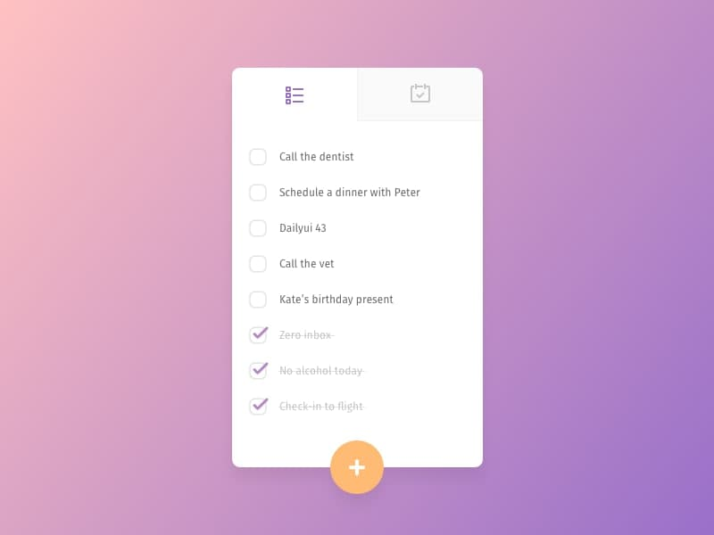

# React Todo App Markup

[DEMO](https://zhenya-mezhueva.github.io/react-todo-list)

## Задача

Используя API https://jsonplaceholder.typicode.com/todos выполнить HTTP GET запрос для загрузки массива с todo элементами.
Затем сверстать UI списка наиболее приближенно к тому как он изображен на картинке и вывести туда загруженные данные (кол-во элементов можно обрезать после загрузки или сделать скроллбар).

## Требования
Использовать React как основу для построения UI компонентов и CSS препроцессоры (либо css-in-js) - как удобно. Рабочее приложение делать не нужно, достаточно вёрстки и загруженного списка. Оцениваться будет чистота и качество кода.

## Запуск проекта в IDE
Fork&Clone the Repo

`npm install`

`npm start`
